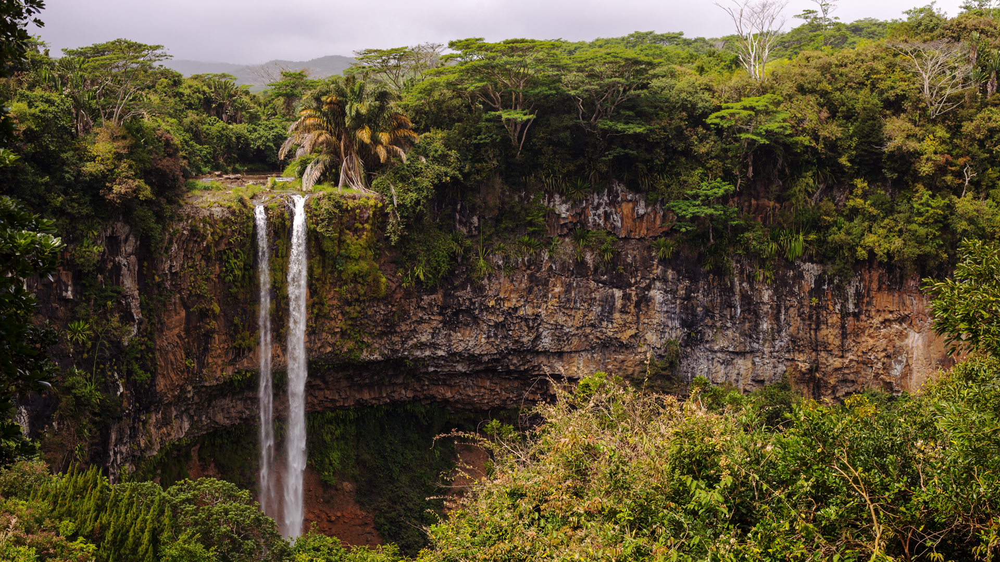
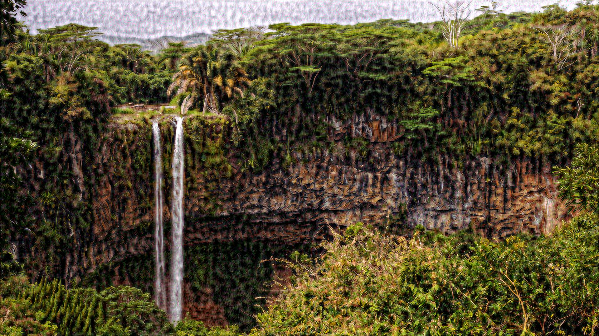
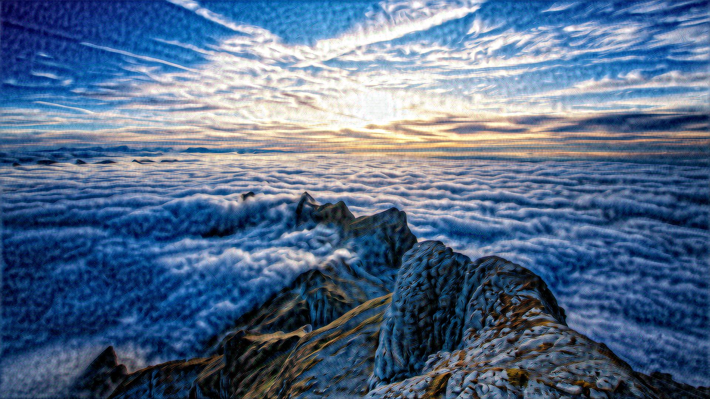
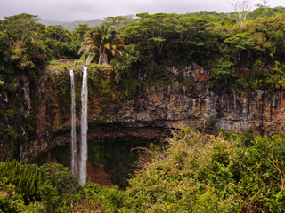
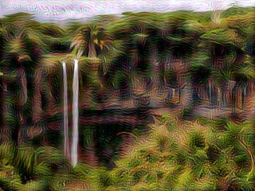
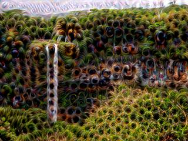
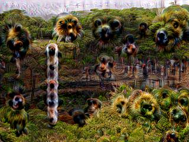

# deepDream

Deep Dream model for any image size

View `python/input` to view the original images, and `python/output/IMAGE_NUM` to view the output of all layers for every example image.

To run, paste all input images into the `input` directory. They must be numerically named (starting at 1), and must only be `.jpg` files. The output files will be located in the `output` directory under whichever image number you desire.

## Example
### Image 1 (1920x1080):

Input:

Output of layer 1

Output of layer 2

### Image 2 (1920x1080):

Input:

Output of layer 1

Output of layer 2

### Image 14 (320x240)

Input:

Output of layer 1:

Output of layer 4:

Output of layer 5:

